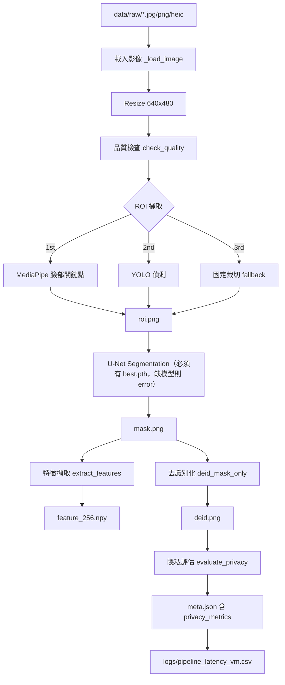

# CheckNow — Pipeline 全流程說明

> 目的：讓你一眼看懂整個系統的結構、每個階段做什麼、程式在哪、背後邏輯怎麼算出來的。

---

## 1. 整體流程圖



---

## 2. 每個階段做什麼

### Stage 0：載入與前處理
| 項目 | 內容 |
|---|---|
| 程式 | `src/pipeline_local.py` → `_load_image()` |
| 輸入 | `data/raw/<id>.jpg/.png/.heic` |
| 做什麼 | 讀圖（支援 HEIC），統一 resize 成 640×480 |
| 為什麼 | 固定輸入尺寸讓延遲量測穩定、下游模型行為一致 |

### Stage 1：品質檢查（Quality Gate）
| 項目 | 內容 |
|---|---|
| 程式 | `src/roi/quality_check.py` → `check_quality()` |
| 檢查 | 模糊（blur）、過暗、過亮、解析度過低 |
| 結果 | 不通過 → `status=quality_fail`，但流程仍繼續跑完 |
| 為什麼 | 標記品質差的樣本，讓後續統計可以分開分析 |

### Stage 2：ROI 擷取（3 層 fallback）
| 順序 | 方法 | 程式 |
|---|---|---|
| 1 | MediaPipe 臉部關鍵點推嘴部區域 | `src/roi/roi_mediapipe.py` |
| 2 | YOLO 偵測器直接找舌頭 | `src/roi/roi_yolo_detect.py` |
| 3 | 固定比例裁切（最後手段） | `src/roi/roi_fixed_crop.py` |

背後邏輯：前面方法失敗才往下走，`meta.json` 的 `roi_method_used` 會記錄實際用了哪一層，`error` 記錄前面失敗的原因。輸出 `roi.png` 和 `roi_bbox=[x1,y1,x2,y2]`。

> 已移除：舊版的「YOLO .txt 標註」fallback。原因：它讀的是 pipeline 自己寫的偽標註（上次偵測結果），把猜測當真相用，會因舊檔過期而用錯框。連帶移除了寫偽標註的 `should_cache_yolo_label` 邏輯。

### Stage 3：Segmentation（舌體分割）
| 項目 | 內容 |
|---|---|
| 唯一路徑 | `models/seg/best.pth` 必須存在 → U-Net(MobileNetV2) 推論，`src/seg/inference.py` |
| 缺模型時 | 直接報錯 `seg_model_missing`，該張 `status=error` |
| 後處理 | 只保留最大連通區塊（去掉下巴/脖子雜訊） |
| 座標處理 | ROI 內的 mask 貼回全圖座標，輸出 `mask.png`（全圖大小，0/255） |

背後邏輯：模型只看 ROI 裁切圖（256×256），推論完再 resize 回 ROI 大小、貼回原圖位置。這樣模型專注在舌頭區域，速度也快。

> 已移除：HSV 色彩 fallback。原因：HSV 規則的 mask 品質和 U-Net 差很多，但輸出檔案長得一樣，會污染資料與 benchmark。沒模型就診實報錯，不假裝能跑。

### Stage 4：特徵擷取
| 項目 | 內容 |
|---|---|
| 程式 | `src/seg/feature_extractor.py` → `extract_features()` |
| 輸出 | `feature_256.npy`，float32、shape=(256,) |
| 背後邏輯 | 只統計 mask 內的像素（顏色分佈等），把舌頭轉成固定長度向量 |

### Stage 5：去識別化（DeID）
| 項目 | 內容 |
|---|---|
| 程式 | `src/deid/deid_mask_only.py` → `deid_mask_only()` |
| 方法 | mask-only：mask 內保留原像素，mask 外全部塗黑 |
| 輸出 | `deid.png` |

背後邏輯：`deid = zeros; deid[mask>127] = image[mask>127]`。臉、背景、任何可識別資訊都變黑，只剩舌頭。

### Stage 6：隱私評估（W1/W2 新增）
| 項目 | 內容 |
|---|---|
| 核心程式 | `src/privacy/deid_metrics.py` → `evaluate_privacy()` |
| 批次程式 | `src/privacy/evaluate_batch.py`（離線重算 + 產報表） |
| pipeline 內嵌 | `src/pipeline_local.py` 在寫 deid.png 之後直接評估，結果寫進 `meta.json` |

### Stage 7：輸出與記錄
| 檔案 | 內容 |
|---|---|
| `data/out/<id>/meta.json` | ROI 方法、品質結果、耗時、`privacy_metrics`、狀態 |
| `logs/pipeline_latency_vm.csv` | 每張的 roi/seg/feat/deid/total 毫秒數 |

---

## 3. 隱私指標的背後邏輯（怎麼算出來的）

### 3.1 背景洩漏比例 background_leak_ratio
```
洩漏像素 = mask 外、但 deid 圖上不是黑色（任一通道 > 8）的像素
background_leak_ratio = 洩漏像素數 / mask 外總像素數
```
- 理想值 = 0（mask 外應該全黑）
- 門檻：> 0.005（0.5%）→ 記 `leak_too_high`

### 3.2 保留區完整度 retention_completeness
```
保留成功像素 = mask 內、deid 與原圖差異 <= 8 的像素
retention_completeness = 保留成功像素數 / mask 內總像素數
```
- 理想值 = 1（舌頭區域應該原封不動）
- 門檻：< 0.98 → 記 `retention_too_low`

### 3.3 風險分數 privacy_risk_score（0–100，越高越危險）
```
leak_norm = min(1, leak_ratio / 0.02)     # 2% 洩漏視為滿級風險
risk = 100 × (0.7 × leak_norm + 0.3 × (1 - retention))
```
- 洩漏權重 0.7 > 完整度權重 0.3，因為背景外洩比舌頭缺角更危險
- 門檻：> 20 → 記 `risk_too_high`

### 3.4 是否通過 privacy_pass
```
privacy_pass = (無任何 issue)
issue 種類：mask_empty / leak_too_high / retention_too_low / risk_too_high
```
三個門檻同時滿足 + mask 不為空，才算 pass。

### 3.5 為什麼 leak 幾乎都是 0？
因為 deid 是「從同一張圖複製 mask 內像素、其餘填 0」，數學上 mask 外必為黑。
這個指標的真正價值：
1. 離線驗證 `deid.png` 檔案沒有被改動/壓縮破壞
2. 未來換成模糊、馬賽克等 deid 方法時，當回歸測試

### 3.6 曾經踩過的坑（已修）
| 問題 | 原因 | 修法 |
|---|---|---|
| 120 張全部 shape mismatch | pipeline 有 resize 到 640×480，離線評估拿原始大圖比對 | `evaluate_batch.py` 先把 raw 對齊到 deid 尺寸 |
| 5 張 retention_too_low 誤判 | 對齊用 INTER_AREA，pipeline 用 INTER_LINEAR，插值差異超過容忍值 | 統一改用 INTER_LINEAR |

---

## 4. 驗證層（validate_outputs.py）

| 檢查 | 函式 | 判什麼 |
|---|---|---|
| 檔案齊全 | `_check_output_files()` | 5 個必要輸出檔都存在 |
| meta 正確 | `_check_meta()` | image_id/input_file 一致、無 pipeline error、有 timing |
| 隱私合格 | `_check_privacy()` | `privacy_metrics` 存在、欄位型別正確、`privacy_pass=True` |
| CSV 對得上 | `_check_csv()` | latency CSV 有這張、不重複、檔名一致 |

```
final_result = pass 需要：has_all_files AND meta_ok AND privacy_ok AND csv_ok
```

輸出：`evidence/batch/validation_summary.csv`

---

## 5. 三個指令的分工

| 指令 | 角色 |
|---|---|
| `python src/pipeline_local.py` | 生產者：跑全流程、產出所有檔案（meta 已含 privacy_metrics） |
| `python src/privacy/evaluate_batch.py` | 稽核者：離線重算隱私指標、產 `privacy_report.csv` + `privacy_summary.md` |
| `python src/validate_outputs.py` | 守門員：檢查所有輸出完整且隱私通過，產 `validation_summary.csv` |

執行順序：pipeline → evaluate_batch → validate_outputs

---

## 6. 目前狀態（2026-08-21）

- 批次：120 張
- Privacy pass rate：100%（修正插值 bug 後）
- Mean leak ratio：0.000000
- Mean retention：1.000000
- Validation：120/120 pass
- 結論：W1、W2 完成，可進 W3（三容器微服務拆分）
